<h1 align="center"><b>Hi, I'm Jhonatan Dczel </b></h1>

  

 

## <picture></picture> **About me**

<picture>
  <source media="(max-width: 700px)" srcset="">
  
</picture>

 

+ 💻 I'm currently studying System Engineering at [National University of San Agustín](https://www.unsa.edu.pe/), Peru (2023 - 2027).
+ 🛠️ Take a look at my [Systems Engineering projects](https://github.com/stars/JhonatanDczel/lists/computer-systems-engineering-projects).
+ 🌱  I'm on track for learning more about Web Development.
+ 🎤 In my free time, I do freestyle, listen to music, play chess and guitar as my hobbies.
+ 📮 My contact details are below ↓
+ 🎨 Fun fact: Although I started programming in 2023, take a look at my commits from 2017 😉
  

  <h3>Counter visitors 👀</h3>

## <b> Tech Stack</b>

