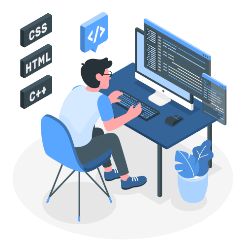

<h1 align="center">
  <b>Hi, I'm Jhonatan Arias (JhonAQ)</b>
  
</h1>

  

  
  
  

## <picture></picture> Sobre mí

<picture>
  <source media="(max-width: 700px)" srcset="">
  
</picture>

 

- 🎓 Estudiante de **Ingeniería de Sistemas** en la **[Universidad Nacional de San Agustín (UNSA)](https://www.unsa.edu.pe/)** (2023–2027).
- 🚀 Construyo productos web/mobile con enfoque en **UI/UX**, performance y DX.
- 🧠 Me gusta conectar **fundamentos CS** (SO, algoritmos, C++) con **ecosistemas modernos** (Next.js, SaaS, Supabase).
- 🛠️ Mira mis listas/colecciones: **[mis Star Lists](https://github.com/JhonAQ?tab=stars)**.
- 🌍 Disponible para oportunidades **Remote / B2B / Contractor**.
- 🎤 Hobbies: freestyle, música, ajedrez y guitarra.
- ✉️ Email: **[jhonaq.1602@gmail.com](mailto:jhonaq.1602@gmail.com)**

 

##  Tech Stack

  
  
  
  
  
  
  
  
  

  

    
    
    
    
    
    
    
    
    
    
    
    
    
    
    
    
    
    
    
    
    
    
    
    
    
    
  

##  GitHub Stats

  
  

  

## <picture></picture> Contactame

|  |
| :--: |
| **[Jhonatan Arias](https://github.com/JhonAQ)** |
|     |
